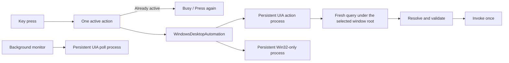

# Vizhi Desktop — the Windows UI Automation helper

`vizhi-desktop-uia.exe` is the Windows half of the desktop seam: what `tools/desktop/VizhiAxBridge`
is on macOS. Persistent, bounded helper processes, one JSON response per request, the same snapshot
contract on both operating systems. `Program.cs` holds the verbs and the UIA plumbing;
`UiaMatching.cs` holds the matching rules and has no UIA in it, so the test suite links it and
holds it to the macOS helper's answers (`tests/UiaMatchingTests.cs`).

Built like every other Windows helper since #83: self-contained, trimmed, single file, UI
Automation through its COM interface (`UiaInterop.cs`) rather than the WPF wrapper. About 12 MB.

## Windows request architecture (#155, #157)



The plugin warms the three lanes asynchronously after its package path is available. Polling
and a key's own status checks use different UIA processes. `focus` and `restore-front` use
`serve-win32`, which never initializes UIA and refuses UIA verbs. This preserves the process
boundary behind the foreground-restoration finding below without starting an executable for
every hand-back. Keep that boundary: a second request to the same UIA process is not equivalent
to the old second process. Actual foreground hand-back still needs the hardware/EDR press pass.

Each UIA worker owns its connection and roots on one long-lived MTA thread, following
[Microsoft's UIA threading guidance](https://learn.microsoft.com/en-us/windows/win32/winauto/uiauto-threading).
The helper owns no UI windows and uses Win32 clipboard calls rather than STA-only OLE APIs.
The native lane smoke verifies the apartment and process isolation. `Test-UiaRepeatedSnapshots.ps1`
exercises reads past periodic COM-wrapper collection and reports timing without app content.

Conversation keys use one `press --conversation ... --focus-after` request. The helper resolves
the exact row, invokes it, and verifies the exact target HWND is foreground. An already-focused
window needs no artificial 100 ms sleep. If focus is refused after the press, the response records
that separately; the client never replays the press. Older helpers that omit the `focused` field
retain the separate focus request for compatibility. macOS retains its existing implementation
through the default `IDesktopAutomation.OpenConversation` method.

`UiaRootCache` retains one root keyed by HWND and PID. Every operation queries the current provider
again. A changed window/process or unavailable provider invalidates the root; a failed read can
reacquire it once. Action invocations are never retried. The reusable `CacheRequest` contains only
properties consumed by the reader. Cached property values and child lists never survive a request.
This is the freshness boundary described in
[Microsoft's caching guidance](https://learn.microsoft.com/en-us/windows/win32/winauto/uiauto-cachingforclients).
Structure-change subscriptions are unnecessary for this root-only cache because no saved control
snapshot is trusted on the next operation.

For an exact conversation title, `FindAllBuildCache` searches the selected window and fetches only
matching subtrees. Conditions include every property from which the reader derives display text.
A match still needs the adapter's sidebar marker. Overlapping query roots are deduplicated by UIA
runtime ID, never by title. Distinct rows, truncated data, and unknown layouts fall back to the full
tree so the existing project/Recents deduplication and ambiguity rules remain authoritative.
Approval/card checks, Send, and other state-sensitive operations continue to read a fresh full
snapshot. No element discovered by a previous key press is saved as a later action target.

Status snapshots use `AutomationElementMode_None`: all properties are freshly fetched, but the
snapshot does not retain live references to every control. The monitor only reads cached values;
acting verbs still request full references. `tests/windows/Test-UiaStatusSnapshots.ps1` compares
all status fields against the full-reference path (`status --live-snapshot`) on the live app,
without printing or saving UI text.

View Changes performs its context validation inside `open-panel`, avoiding a separate Windows
status preflight. One fresh snapshot establishes the selected conversation, mode, modal state,
document ownership and whether the panel is already open. An actual press still requires a
second fresh snapshot with the same target identity, followed by panel confirmation. An already
open panel needs only one snapshot. The first observation and post-press confirmation use
cached-only references; the second observation obtains live references for the invocation.
These panel snapshots use a control view: all actionable nodes and button candidates, nested
document boundaries, project list items, tabs, tabpanels, dialogs and menus remain. Plain
transcript/diff text and layout wrappers are omitted. The provider promotes retained descendants,
so document ownership, sidebar ancestry and nested-button ambiguity still apply. Status,
approval and composer operations keep their raw snapshots. `open-panel --full-scan` retains the
raw path for diagnosis; `inspect --panel-controls` shows the reduced view.
A selected review tab and matching app-owned tabpanel (`--panel-tab`) confirm an open panel
even while its file controls are loading. Unselected tabs, duplicate panels and nested preview
documents do not count. `--timing` reports `fullScans`, the apartment, and numeric fetch/walk
timings per scan; `open-panel --dry` validates the route without invoking the opener.
The helper still refuses ambiguous or changed context.
If confirmation times out or its reply is lost, the keypad says "Check app" rather than
asserting that the panel failed to open. It never repeats the invocation automatically.

`tests/windows/Test-UiaPanelSnapshots.ps1` compares dry-run results in both views, including a
hash of conversation/document/opener identities (`--dry --audit-panel-view`), and checks a
wrong-mode refusal. It focuses the app but does not invoke the opener. The 2026-10-05 local
device pass matched five pairs each with the panel open and closed; the open panel had 415
retained elements versus 1,613 raw, with median checks of 100 ms versus 206 ms. End-to-end opens
still depend on app rendering and provider stalls; these are local helper measurements, not
managed-endpoint QA acceptance. If the first post-press snapshot blocks and returns the pre-open
tree, the helper takes a second fresh observation even if that read consumed the 3 s confirmation
window. The client's 7 s overall request deadline still applies; no press is repeated.

Startup and work have separate deadlines. The readiness handshake measures startup, with a 5 s
ceiling; once ready, each request gets its own existing operation budget. A first action cannot
consume unused startup time. Compatibility/contended one-shots use measured startup plus a 250 ms
margin when available. Shutdown cancels all owned children and generation checks prevent late
callbacks from starting a replacement after unload.

Rejected presses are never queued. Commands show a per-key Busy face for 1.8 s; Find Chat and
Attach Files remain on a retry page until the user retries or goes back. This also applies to
Approve, Deny, Send, and hold-to-discard. The `DesktopAction(...)` log measures the whole dispatched
action, including its helper requests, and names only the command class (no chat title or draft).

## Measuring the changes

`../measure-uia-helper.ps1` compares one-shot and served frontmost/status reads. To compare full
conversation resolution with the narrow query, save an exact visible chat title in a UTF-8 file
without a trailing newline, then run in Windows PowerShell 5.1 or newer:

```powershell
powershell -File tools/windows/measure-uia-actions.ps1 `
  -Exe path/to/vizhi-desktop-uia.exe -TitleFile title.txt -Count 10 -OutputPath timings.json
```

This is read-only by default (`--dry`). `-Invoke` explicitly opens the named chat for each sample,
without typing or sending. In that mode the full-scan baseline includes a separate focus request;
the query path includes focus in the press request. A refusal stops the run rather than retrying an
action. Samples include wall time, scan/invoke/focus time, and fallback counts, but no UI text.
Use `--full-scan` only to compare resolution paths, and `--timing` for the phase counters.

Local read-only timings do not establish complete-press latency on a managed endpoint. Before
release, repeat the QA report's conversation, Approve/Deny, Find Chat, and View Changes pass under
CrowdStrike; collect a nine-minute log and confirm no routine overruns. Include duplicate/project
titles, changed app windows, rapid presses, disable/enable, and uninstall. Never automate an
approval or Send against an uncontrolled live conversation. macOS needs the Busy-face device pass.

## What the reconnaissance established (2026-09-30, on the live app)

- The Windows app is the Store package **OpenAI.Codex** (family `OpenAI.Codex_2p2nqsd0c76g0`,
  display name "ChatGPT"), executable `app\ChatGPT.exe`, Chromium 153 under OpenAI's "owl"
  runtime. One package carries both surfaces, like the Mac bundle. The adapter names the process
  `ChatGPT`; several processes share the name and one owns the window.
- **Every label the macOS adapter uses reads the same on Windows**: `Allow once`, `Deny`, `Stop`,
  `Switch mode, current mode: …`, `Pin chat`, `New chat`, `Search`, `Add files and more`,
  `Change permissions`, `Start new voice chat`, `Work with ChatGPT`, the status containers.
- A popup button (`Switch mode`, `Add files and more`, `Change permissions`) exposes
  ExpandCollapse, not Invoke; a pressed-state button exposes Toggle. The helper treats all of
  Invoke, Toggle, ExpandCollapse and SelectionItem as "pressable" and presses through whichever
  the control offers.
- **Chromium serves no page content while the screen is locked.** The document element stays
  with nothing under it. `status` reports `surface:false` for that, never an empty page; the keys
  read Hidden. A minimised window and one fully covered by a maximised window both keep serving
  the whole page (device pass, 2026-09-30: the same status 2 s and 12 s after minimising), and a
  press on the minimised window lands — it takes the foreground without restoring the window,
  and `restore-front` hands it back.
- A cache request scoped to the subtree fetches the whole tree in one cross-process call:
  ~320 ms for 365 nodes, against ~2 s walking it property by property.
- **A UIA press activates the app's window.** Chromium performs Invoke as a click and a click
  focuses; the Mac's AXPress does not. Verified with the terminal in front: after `press`,
  ChatGPT is in front. The process that made the UIA call is then refused
  `SetForegroundWindow`, while a fresh process is accepted at once — so `press` reports
  `frontMoved` and `frontBeforeHwnd`, and the client runs `restore-front` as a second
  invocation (~150 ms). The conversation key skips that, since it shows the chat on purpose.
- The composer accepts a direct value write (`write` → ValuePattern.SetValue, ~600 ms), after
  which Send appears and `canSend` reads true.

## Running it by hand

Open the ChatGPT app, then:

```powershell
.\vizhi-desktop-uia.exe inspect                                   # every visible window
.\vizhi-desktop-uia.exe inspect --process ChatGPT --require-process         # controls only
.\vizhi-desktop-uia.exe inspect --process ChatGPT --require-process --all   # every node
.\vizhi-desktop-uia.exe frontmost --process ChatGPT
.\vizhi-desktop-uia.exe status --require-process --process ChatGPT `
  --approve "Allow once" --deny "Deny" --stop "Stop" `
  --attention "needs attention" --mode-prefix "Switch mode, current mode: " `
  --conv-marker "Pin chat" --state-awaiting "Awaiting approval" --state-unread "Unread" --state-running "Working"
.\vizhi-desktop-uia.exe press --require-process --process ChatGPT --label "New chat" --dry
```

`--dry` reports what a press would hit without pressing. `--all` includes message text; inspect
the file before sharing it if the open conversation is sensitive.

## Every macOS verb has its Windows counterpart

`Program.cs` (target, scan, status, press, restore-front, voice, open-panel, focus),
`ComposerVerbs.cs` (draft-target, append-target, write, append, send, attach-image,
attach-files), `ContextVerbs.cs` (copy-reply, context-clipboard / selection / window /
screenshot / return / paste) and `SearchVerbs.cs` (search). Checked live on 2026-09-30:
status, presses, the focus hand-back, write, append, send's refusals, Copy Reply, the clipboard
read, the window-behind capture, and the whole Find Chat flow (open, type, results, select).

What the Windows app does differently, and how the port answers it:

- The composer is written through the value pattern, which replaces the whole value. `write`
  goes only into an empty composer; `append` writes original + separator + text and proves by
  fingerprint that the original survived.
- Footer buttons are each wrapped in their own group, so Copy is tied to its response actions
  by the buttons' bounding boxes (the macOS geometry fallback, now the usual route).
- Search results are list items with no URL: a result's id is its title's fingerprint, and the
  key shows the item's first text — the chat title — not the accessible name that runs title,
  project, shortcut and snippet together.
- Attachments go in by a verified paste: file list on the clipboard, composer focused through
  UIA and proven focused, one Ctrl+V, attachment confirmed by name, clipboard given back.
- The region screenshot is the shared toolkit's snip (`claude-console-tools.exe shot`), which
  ships beside this helper; the window-behind capture is `PrintWindow`.
- App 26.928 shows no Changes summary row. The reply's edit summary carries "View changes",
  which opens the same Changes tab; `open-panel` takes it as an opener and confirms by
  "Show files" or the selected Changes tab with its matching tabpanel. The tab and panel can
  establish the destination without waiting for its file controls (2026-10-05 device retest).
  "View changed files" beside it is the file disclosure and is never pressed.
  Every edited reply keeps its own "View changes", and each opens the same tab on the last
  turn, so the adapter names it a turn label (`--changes-turn`, `--panel-open-turn`): with no
  summary row the latest reply's button is pressed. The macOS helper does not take these
  arguments yet; there, two edited turns are still refused as `panel-opener-multiple`.

## Not yet checked live (the device pass)

- A real approval card: Approve and Deny from another app, with the focus hand-back running
  from LogiPluginService rather than a terminal.
- `voice` (starts a real voice chat), `send` (sends a real message), `attach-image` and
  `attach-files` (need a real file to attach), `context-selection` (copies from another app),
  `context-paste`, `context-screenshot` (the snip overlay).
- The tree when the window is on another virtual desktop.
- Options+ binding to a Store app, and the Vizhi Home layout importing on Windows.

## Packaging

`SHIPS_WINDOWS=1` for VizhiDesktop; `build-windows-payload.sh` stages this helper and the
toolkit (no hook); `verify-package.sh` refuses a helper nothing launches; the package declares
`pluginFolderWin: bin`. Packing and signing run on the Mac.
